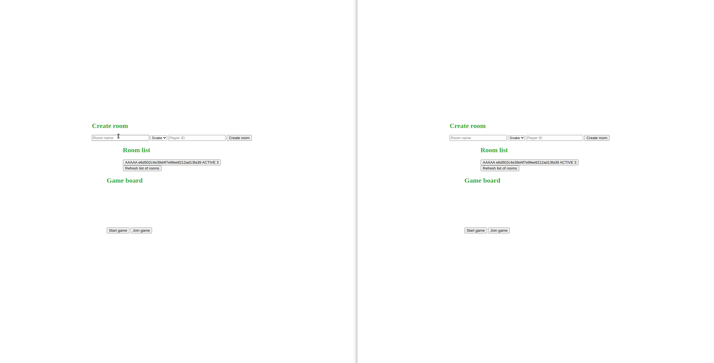

# Spring Boot realtime game server 

## TODO multiplayer games
- [ ] snake
- [x] draw

## TODO:
- [ ] rooms to play given game
- [ ] optimize communication between client and server - do not send whole game state but only the incremental update state
- [ ] real multiplayer with player identification
- [ ] do the server more generic
- [ ] fix the code
- [ ] add more games

## client-server communication approaches 
- [x] Long Polling Using DeferredResult
- [ ] Server-Sent Events
- [ ] WebSockets